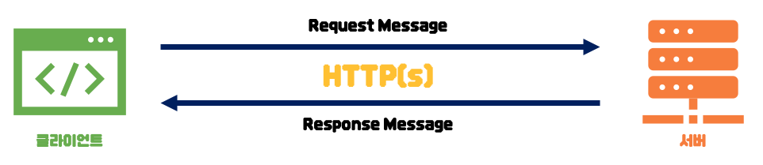

# **HTTP란?**

http(Hyper Text Transfer Protocol)이란 WWW(World Wide Web)에서 정보를 주고받기 위해 사용되는 프로토콜이다.

클라이언트와 서버 간의 통신을 담당하며, 클라이언트가 서버에 Request를 보내고, 서버는 클라이언트에 Response를 반환하는 방식으로 동작한다.

주로 웹 브라우저와 웹 서버 간의 통신에 사용된다.

-   웹 페이지 다운로드
-   폼 데이터 전송
-   이미지나 동영상 파일 요청 등..

HTTP Request 메시지는 HTTP Method(GET, POST, PUT, DELETE 등)와 요청 대상 URL Headers, body 등으로 구성된다.

HTTP Response 메시지는 status code, Headers, body등으로 구성된다.

HTTP는 상태를 유지하지 않는(stateless) 프로토콜이다.

-   이전 요청과의 상태 정보를 유지하지 않는다.
-   서버-클라이언트 간의 정보 유지를 위해 **쿠키**, **세션** 등을 사용한다.

보안을 위해 S(Secure)를 추가한 **HTTPS** 버전도 제공한다.

-   **SSL(Secure Socket Layer)**, **TLS(Transport Layer Security)** 프로토콜을 사용하여 통신 내용을 암호화한다.
