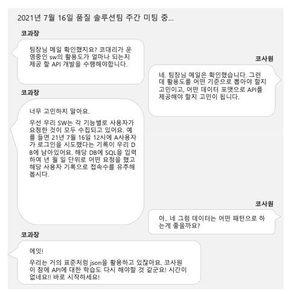

# 2주차

-   인터페이스 가이드 문서 작성

    -   제공된 인터페이스 가이드를 참고하여 API 가이드를 작성
    -   SW 활용률(접속자 수, 부서별 접속자 수, 로그인 요청 수, 게시글 작성 수)에 필요한 데이터를 고민해보고 해당 내용에 맞게 문서를 작성.

-   내용
    
    ### 통계 API 구축

1. 월별 접속자 수
2. 일자별 접속자 수
3. 평균 하루 로그인 수
4. 휴일을 제외한 로그인 수
5. 부서별 월별 로그인 수