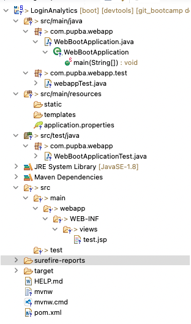
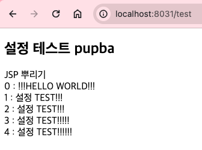
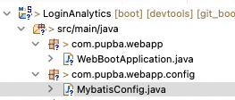
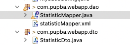
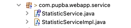
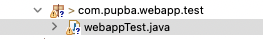
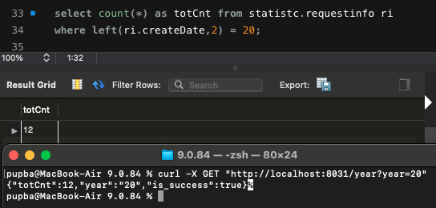

# **3주차**

### 1. 스프링 부트 환경을 구축해보고 1주차에 진행한 스프링 환경과 어떻게 다른지 확인(환경 구축 가이드 제공)

---

#### Spring Boot Env 구축

1. 프로젝트 생성
    - File -> New -> Progject -> Spring Boot > Spring Starter Project로 프로젝트 생성.
    - **name**은 원하는 이름, **Type**은 Maven, **Java Version**은 17(8이 있으면 8로 선택 어짜피 pom.xml에서 변경 예정).
    - next를 누른 후 **Spring Boot Version**을 2.3.3(2.3.3이 없으면 pom.xml에서 변경) **Spring Boot DevTools**,**MyBatis Framework**,**Spring Web**을 체크하고 Finsh.
2. pom.xml 설정(의존성 수정, DB관련 내용 포함)

```xml
<?xml version="1.0" encoding="UTF-8"?>
<project xmlns="http://maven.apache.org/POM/4.0.0" xmlns:xsi="http://www.w3.org/2001/XMLSchema-instance"
    xsi:schemaLocation="http://maven.apache.org/POM/4.0.0 https://maven.apache.org/xsd/maven-4.0.0.xsd">
    <modelVersion>4.0.0</modelVersion>
    <parent>
        <groupId>org.springframework.boot</groupId>
        <artifactId>spring-boot-starter-parent</artifactId>
        <version>2.2.2.RELEASE</version>
        <relativePath/> <!-- lookup parent from repository -->
    </parent>
    <groupId>com.pupba</groupId>
    <artifactId>LoginAnalytics</artifactId>
    <version>0.0.1-SNAPSHOT</version>
    <name>settingweb_boot</name>
    <description>Demo project for Spring Boot</description>

    <properties>
        <java.version>1.8</java.version>
    </properties>

    <dependencies>
        <dependency>
            <groupId>org.apache.tomcat.embed</groupId>
            <artifactId>tomcat-embed-jasper</artifactId>
            <scope>provided</scope>
        </dependency>

        <!-- jstl 라이브러리 -->
        <dependency>
            <groupId>javax.servlet</groupId>
            <artifactId>jstl</artifactId>
        </dependency>
        <dependency>
            <groupId>org.springframework.boot</groupId>
            <artifactId>spring-boot-starter-jdbc</artifactId>
        </dependency>
        <!--  <dependency>
            <groupId>org.springframework.boot</groupId>
            <artifactId>spring-boot-starter-thymeleaf</artifactId>
        </dependency>-->
        <dependency>
            <groupId>org.springframework.boot</groupId>
            <artifactId>spring-boot-starter-web</artifactId>
        </dependency>

        <!-- https://mvnrepository.com/artifact/org.projectlombok/lombok -->
        <dependency>
            <groupId>org.projectlombok</groupId>
            <artifactId>lombok</artifactId>
            <version>1.16.20</version>
            <scope>provided</scope>
        </dependency>

        <dependency>
            <groupId>org.mybatis.spring.boot</groupId>
            <artifactId>mybatis-spring-boot-starter</artifactId>
            <version>2.1.3</version>
        </dependency>

        <dependency>
            <groupId>org.springframework.boot</groupId>
            <artifactId>spring-boot-devtools</artifactId>
            <scope>runtime</scope>
            <optional>true</optional>
        </dependency>

        <dependency>
            <groupId>org.mariadb.jdbc</groupId>
            <artifactId>mariadb-java-client</artifactId>
        </dependency>

        <dependency>
            <groupId>org.springframework.boot</groupId>
            <artifactId>spring-boot-starter-test</artifactId>
            <scope>test</scope>
            <exclusions>
                <exclusion>
                    <groupId>org.junit.vintage</groupId>
                    <artifactId>junit-vintage-engine</artifactId>
                </exclusion>
            </exclusions>
        </dependency>
    </dependencies>

    <build>
        <plugins>
            <plugin>
                <groupId>org.springframework.boot</groupId>
                <artifactId>spring-boot-maven-plugin</artifactId>
            </plugin>
        </plugins>
    </build>

</project>
```

3. application.properties 수정 (src/main/resources)

```properties
# port
server.port = 8031
# contextpath
server.servlet.contextPath=/
# view
# /WEB-INF/views/*.jsp mapping
spring.mvc.view.prefix=/WEB-INF/views/
spring.mvc.view.suffix=.jsp

devtools.livereload.enabled=true
# DB
spring.datasource.driver-class-name=org.mariadb.jdbc.Driver
spring.datasource.url=jdbc:mariadb://127.0.0.1:3306/statistc
spring.datasource.username=test1
spring.datasource.password=qwer
```

3. 기본 테스트
   그림과 같이 **com.~.test** 아래의 **.java** 파일을 수정

```java
package com.pupba.webapp.test;

import java.util.ArrayList;
import java.util.List;

import org.springframework.stereotype.Controller;
import org.springframework.web.bind.annotation.RequestMapping;
import org.springframework.web.servlet.ModelAndView;

@Controller
public class webappTest {

    @RequestMapping("/test")
    public ModelAndView test() throws Exception{
        ModelAndView mav = new ModelAndView("test");
        mav.addObject("name", "pupba");
        List<String> resultList = new ArrayList<String>();
        resultList.add("!!!HELLO WORLD!!!");
        resultList.add("설정 TEST!!!");
        resultList.add("설정 TEST!!!");
        resultList.add("설정 TEST!!!!!");
        resultList.add("설정 TEST!!!!!!");
        mav.addObject("list", resultList);
        return mav;
    }

}
```

그리고 application.properties에서 정의한 경로에 jsp 생성(src/main/webapp/WEB-INF/views)

```jsp
<%@ page language="java" contentType="text/html; charset=UTF-8" pageEncoding="UTF-8"%>
<%@ taglib prefix="c" uri="http://java.sun.com/jsp/jstl/core"%>
<!DOCTYPE html>
<html lang="ko">
     <head>
         <meta http-equiv="Content-Type" content="text/html; charset=UTF-8">
         <title>View Test Page</title>
     </head>
 <body>
     <h2>설정 테스트 ${name}</h2>
     <div>JSP 뿌리기</div>
     <c:forEach var="item" items="${list}" varStatus="idx">
         ${idx.index} : ${item} <br />
     </c:forEach>
  </body>
</html>
```

**경로**<br>


**실행 화면(프로젝트를 spring boot app으로 실행)**<br>


### 2. SW활용현황 API의 하나인 20년도 총 로그인 수 API 개발(가이드 제공)

#### API를 위한 DB Table 생성

```sql
CREATE DATABASE statistc;

CREATE Table statistc.requestInfo (
    requestID numeric NOT NULL primary key,
    requestCode varchar(5) NOT NULL,
    userID varchar(5),
    createDate varchar(10)
);

CREATE table statistc.requestCode (
    requestCode varchar(5) NOT NULL primary key,
    code_explain varchar(50) NOT NULL
);

CREATE table statistc.user (
    userID varchar(5) NOT NULL primary key,
    HR_ORGAN varchar(5) NOT NULL,
    USERNAME varchar(5) NOT NULL
);

# 많을 수록 좋음
INSERT INTO statistc.requestInfo(requestID, requestCode, userID, createDate )
VALUES(1, 'L', 'AAA', '2008180520'), #20년 8월 18일 5시 20분
(2, 'O', 'DDD', '2004040404'),
(3, 'L', 'BBB', '2006220920'),
(4, 'L', 'CCC', '1906220920');
```

#### API 작성

1.  mybatis 설정
    <br>
    
    <br>

    ````java
    package com.pupba.webapp.config;

        import javax.sql.DataSource;

        import org.apache.ibatis.session.SqlSessionFactory;
        import org.mybatis.spring.SqlSessionFactoryBean;
        import org.mybatis.spring.SqlSessionTemplate;
        import org.mybatis.spring.annotation.MapperScan;
        import org.springframework.context.annotation.Bean;
        import org.springframework.context.annotation.Configuration;

        @Configuration
        @MapperScan(basePackages = "com.pupba.webapp.dao")
        public class MybatisConfig {

            @Bean
            public SqlSessionFactory sqlSessionFactory (DataSource dataSource) throws Exception {
                SqlSessionFactoryBean sqlSessionFactory = new SqlSessionFactoryBean();

                sqlSessionFactory.setDataSource(dataSource);
                sqlSessionFactory.setTypeAliasesPackage("com.pupba.webapp.dto");

                return sqlSessionFactory.getObject();
            }

            @Bean
            public SqlSessionTemplate sqlSession (SqlSessionFactory sqlSessionFactory) {

                return new SqlSessionTemplate(sqlSessionFactory);
            }

        }
        ```

    ````

2.  maaper 작성

-   db와 mybatis를 활용하기 위한 코드 작성
-   MapperScan 어노테이션을 활용하여 스캔할 패키지를 입력
    <br>
    
    <br><br>
    2.1. StatisticMapper.java

    ```java
    package com.pupba.webapp.dao;

    import java.util.HashMap;

    import com.pupba.webapp.dto.StatisticDto;

    public interface  StatisticMapper {
        public HashMap<String, Object> selectYearLogin(String year);

    }
    ```

    2.2. statisticMapper.xml

    -   `<select>` 안에 쿼리 작성

    ```xml
        <?xml version="1.0" encoding="UTF-8"?>
    <!DOCTYPE mapper
        PUBLIC "-//mybatis.org//DTD Mapper 3.0//EN"
        "http://mybatis.org/dtd/mybatis-3-mapper.dtd">

    <mapper namespace="com.pupba.webapp.dao.StatisticMapper">

        <select id="selectYearLogin" parameterType="string" resultType="hashMap">
            select count(*) as totCnt
            from statistc.requestinfo ri
            where left(ri.createDate, 2) = #{year};
        </select>

    </mapper>
    ```

3.  Service 작성(비즈니스 로직 작성)
    <br>
    
    <br>
    <br>
    3.1. StatisticService.java

    ```java
    package com.pupba.webapp.service;
    import java.util.HashMap;
    public interface StatisticService {
        public HashMap<String,Object> yearloginNum(String year);
    }
    ```

    3.2. StatisticServiceImpl.java

    ```java
    package com.pupba.webapp.service;

    import java.util.HashMap;
    import org.springframework.beans.factory.annotation.Autowired;
    import org.springframework.stereotype.Service;

    import com.pupba.webapp.dao.StatisticMapper;

    @Service
    public class StatisticServiceImpl implements StatisticService {


        @Autowired
        private StatisticMapper uMapper;

        @Override
        public HashMap<String, Object> yearloginNum (String year) {
            // TODO Auto-generated method stub
            HashMap<String, Object> retVal = new HashMap<String,Object>();

            try {
                retVal = uMapper.selectYearLogin(year);
                retVal.put("year", year);
                retVal.put("is_success", true);

            }catch(Exception e) {
                retVal.put("totCnt", -999);
                retVal.put("year", year);
                retVal.put("is_success", false);
            }

            return retVal;
        }

    }
    ```

4.  Setting 코드 수정
    <br>
    
    <br>
    <br>

    ```java
    package com.pupba.webapp.test;

                import java.util.ArrayList;
                import java.util.HashMap;
                import java.util.List;
                import java.util.Map;

                import org.springframework.beans.factory.annotation.Autowired;
                import org.springframework.stereotype.Controller;
                import org.springframework.web.bind.annotation.RequestMapping;
                import org.springframework.web.bind.annotation.ResponseBody;
                import org.springframework.web.servlet.ModelAndView;

                import com.pupba.webapp.dao.StatisticMapper;
                import com.pupba.webapp.service.StatisticService;


                @Controller
                public class webappTest {


                    @Autowired
                    private StatisticService service;

                    @ResponseBody
                    @RequestMapping("/sqlyear-statistic")
                    public Map<String, Object> sqltest(String year) throws Exception{
                        // 임의로 GET을 통해 url에 parameter를 입력하여 결과를 요청
                        return service.yearloginNum(year);
                    }

                    @RequestMapping("/test")
                    public ModelAndView test() throws Exception{
                        ModelAndView mav = new ModelAndView("test");
                        mav.addObject("name", "devfunpj");
                        List<String> resultList = new ArrayList<String>();
                        resultList.add("!!!HELLO WORLD!!!");
                        resultList.add("설정 TEST!!!");
                        resultList.add("설정 TEST!!!");
                        resultList.add("설정 TEST!!!!!");
                        resultList.add("설정 TEST!!!!!!");
                        mav.addObject("list", resultList);
                        return mav;
                    }

                }
    ```



---

### 3. 마지막 주차 API 구현에 필요한 SQL(멘토가 요구하는 질의에 대한 SQL)을 작성

#### 1. DB 생성 및 테이블 생성, 임의 데이터 삽입

```sql
# 접속 통계 DB 생성
CREATE DATABASE IF NOT EXISTS ConnStatDB;

# DB 선택
USE ConnStatDB;

# 1. 테이블 생성 : 평일
CREATE TABLE IF NOT EXISTS login_table (
    id INT AUTO_INCREMENT PRIMARY KEY,
    user_id INT,
    login_date DATE,
    department VARCHAR(50)
);

# 2. 테이블 생성 : 휴일
CREATE TABLE IF NOT EXISTS holiday_table (
    id INT AUTO_INCREMENT PRIMARY KEY,
    holiday_date DATE
);

# 데이터 삽입 1000개
INSERT INTO login_table (user_id, login_date, department)
SELECT
    FLOOR(RAND() * 1000) + 1 AS user_id,
    DATE_ADD('2023-12-01', INTERVAL FLOOR(RAND() * 62) DAY) AS login_date,
    CASE
        WHEN FLOOR(RAND() * 2) = 0 THEN '부서A'
        ELSE '부서B'
    END AS department
FROM
    (SELECT 1 UNION ALL SELECT 2 UNION ALL SELECT 3 UNION ALL SELECT 4 UNION ALL SELECT 5 UNION ALL
     SELECT 6 UNION ALL SELECT 7 UNION ALL SELECT 8 UNION ALL SELECT 9 UNION ALL SELECT 10) AS t1
CROSS JOIN
    (SELECT 1 UNION ALL SELECT 2 UNION ALL SELECT 3 UNION ALL SELECT 4 UNION ALL SELECT 5 UNION ALL
     SELECT 6 UNION ALL SELECT 7 UNION ALL SELECT 8 UNION ALL SELECT 9 UNION ALL SELECT 10) AS t2
LIMIT 1000;

'https://www.data.go.kr/data/15012690/openapi.do' --> 공공 API 공휴일 정보를 받아서 DB에 저장
```

#### 2. 월별 접속자 수

```sql
SELECT MONTH(login_date) AS month, COUNT(DISTINCT user_id) AS monthly_visitors
FROM login_table
GROUP BY MONTH(login_date);
```

#### 3. 일자별 접속자 수

```sql
SELECT login_date, COUNT(DISTINCT user_id) AS daily_visitors
FROM login_table
GROUP BY login_date;
```

#### 4. 평균 하루 로그인 수

```sql
SELECT AVG(daily_visitors) AS average_daily_logins
FROM (
    SELECT login_date, COUNT(DISTINCT user_id) AS daily_visitors
    FROM login_table
    GROUP BY login_date
) AS daily_stats;
```

#### 5. 휴일을 제외한 로그인 수

```sql
SELECT COUNT(DISTINCT user_id) AS logins_excluding_holidays
FROM login_table
WHERE login_date NOT IN (SELECT holiday_date FROM holiday_table);
```

#### 6. 부서별 월별 로그

```sql
SELECT department, MONTH(login_date) AS month, COUNT(DISTINCT user_id) AS department_monthly_logins
FROM login_table
GROUP BY department, MONTH(login_date);
```

#### 🐱 공휴일 데이터는 holiday.py 파일을 통해 csv 파일화 한다음, DB에 추가

---
