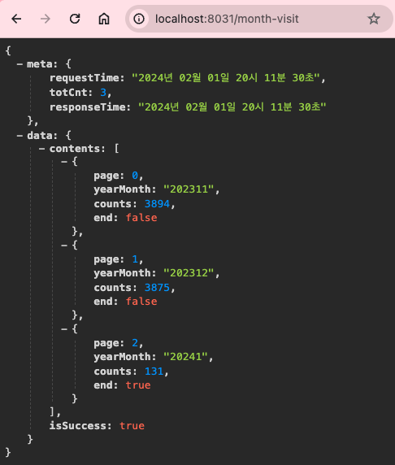
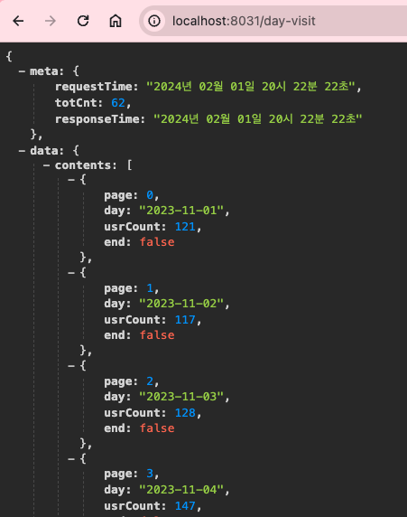
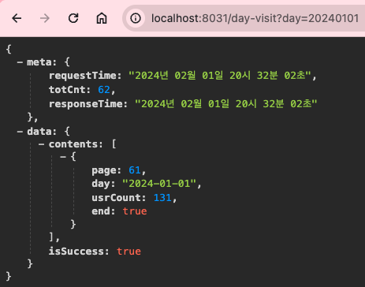
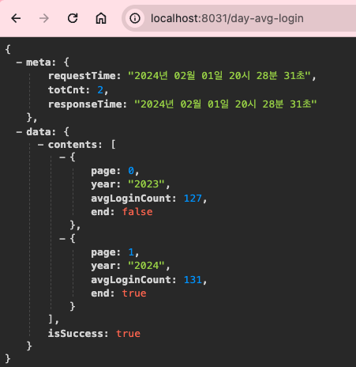
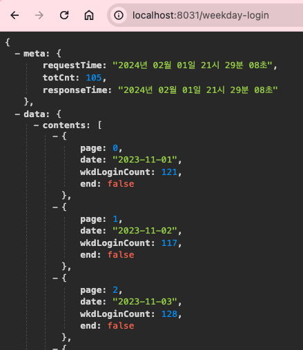
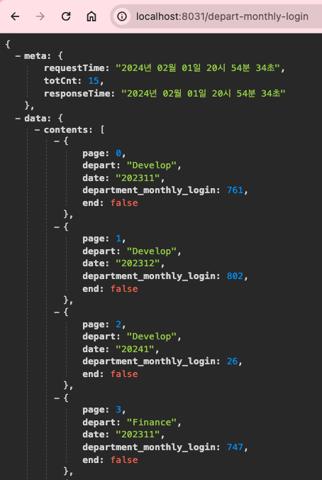
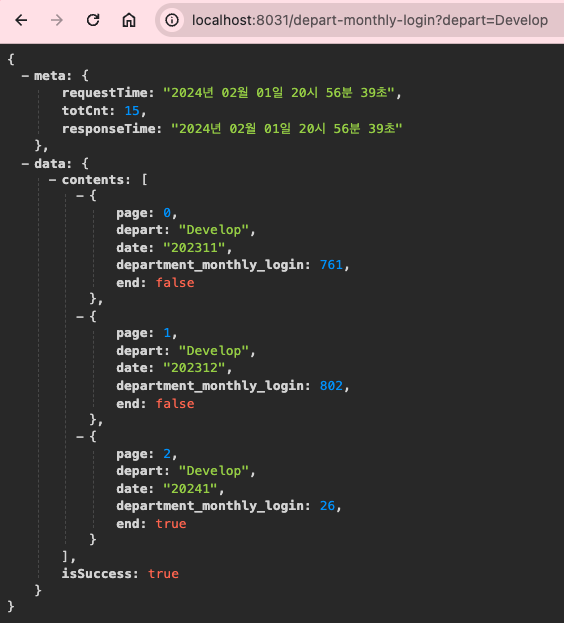

# **4주차**

### 1. 3주차에 작성한 SQL을 바탕으로 총 5가지의 SW 활용 현황 Restful API 개발

#### 1-1. DB 수정

1. 데이터 삽입

    - 부서 부분 HR, Sales, Develop, Marketing, Finance로 쿼리 수정.

    ```SQL
        INSERT INTO login_table (user_id, login_date, department)
        SELECT
            FLOOR(RAND() * 1000) + 1 AS user_id,
            DATE_ADD('2023-11-01', INTERVAL FLOOR(RAND() * 62) DAY) AS login_date,
            CASE FLOOR(RAND() * 5)
                WHEN 0 THEN 'HR'
                WHEN 1 THEN 'Sales'
                WHEN 2 THEN 'Develop'
                WHEN 3 THEN 'Marketing'
                WHEN 4 THEN 'Finance'
            END AS department
        FROM
            (SELECT 1 UNION ALL SELECT 2 UNION ALL SELECT 3 UNION ALL SELECT 4 UNION ALL SELECT 5 UNION ALL
            SELECT 6 UNION ALL SELECT 7 UNION ALL SELECT 8 UNION ALL SELECT 9 UNION ALL SELECT 10) AS t1
        CROSS JOIN
            (SELECT 1 UNION ALL SELECT 2 UNION ALL SELECT 3 UNION ALL SELECT 4 UNION ALL SELECT 5 UNION ALL
            SELECT 6 UNION ALL SELECT 7 UNION ALL SELECT 8 UNION ALL SELECT 9 UNION ALL SELECT 10) AS t2
        LIMIT 1000;
    ```

2. 월별 접속자 수

    - 연도 추가.

    ```SQL
    SELECT YEAR(login_date) AS year, MONTH(login_date) AS month, COUNT(DISTINCT user_id) AS monthly_visitors
    FROM login_table
    GROUP BY YEAR(login_date), MONTH(login_date)
    ORDER BY YEAR(login_date), MONTH(login_date);
    ```

3. 일자별 접속자 수

    - 동일.

    ```SQL
    SELECT login_date, COUNT(DISTINCT user_id) AS daily_visitors
    FROM login_table
    GROUP BY login_date;
    ```

4. 평균하루 로그인 수

    - 연도별 평균하루 로그인 수(출력값 정수) 구하는 것으로 쿼리 수정.

    ```SQL
    SELECT YEAR(login_date) as year, FLOOR(AVG(daily_visitors)) AS average_daily_logins
    FROM (
        SELECT login_date, COUNT(user_id) AS daily_visitors
        FROM login_table
        GROUP BY login_date
    ) AS daily_stats
    GROUP BY year;
    ```

5. 휴일을 제외한 로그인 수(휴일은 별도의 DB or 공공 API)

    - 날짜별로 로그인 횟수 구하도록 쿼리 수정.

    ```SQL
    SELECT login_date as date,COUNT(user_id) AS weekday_login
    FROM login_table
    WHERE login_date not in (SELECT holiday_date FROM holiday_table)
    GROUP BY login_date;
    ```

6. 부서별 월별 로그인 수

    - 년 -> 월 -> 부서 별로 집계하도록 쿼리 수정.

    ```SQL
    SELECT department, YEAR(login_date) as year,MONTH(login_date) AS month, COUNT(user_id) AS department_monthly_logins
    FROM login_table
    GROUP BY department, YEAR(login_date),MONTH(login_date);
    ```

#### 1-2. API 작성

##### 1. 공통 DTO

-   meta 데이터와 data의 초기화
-   meta : 응답 데이터에 관한 데이터
    -   requestTime : 요청 시각
    -   responseTime : 응답 시각
    -   totCnt : 총 데이터 수
-   data : 응답 데이터가 담길 곳

```Java
package com.apis.login_analysis.dto;

import java.time.LocalDateTime;
import java.time.format.DateTimeFormatter;
import java.util.HashMap;

public class BaseDto {
    // meta
    private HashMap<String,Object> meta;
    // contents
    private HashMap<String,Object> data;

    public BaseDto(int cnt) {
        this.meta = new HashMap<String,Object>();
        LocalDateTime cdt = LocalDateTime.now();
        DateTimeFormatter formatter = DateTimeFormatter.ofPattern("yyyy년 MM월 dd일 HH시 mm분 ss초");
        this.meta.put("requestTime",cdt.format(formatter));
        this.meta.put("responseTime"," ");
        this.meta.put("totCnt",cnt);

        this.data = new HashMap<String,Object>();
    }

    public HashMap<String, Object> getMeta() {
        return meta;
    }

    public void setMeta(HashMap<String, Object> meta) {
        this.meta = meta;
    }

    public HashMap<String, Object> getData() {
        return data;
    }

    public void setData(HashMap<String, Object> data) {
        this.data = data;
    }

}
```

##### 2. 월별 접속자 수

```Java
// StatisticMapper.java
package com.apis.login_analysis.dao;
import java.util.HashMap;
import java.util.List;

public interface StatisticMapper {
    public List<HashMap<String,Object>> MonthVisit();
    ...
}
```

```xml
<!-- statisticMapper.xml -->
<mapper namespace="com.apis.login_analysis.dao.StatisticMapper">
<!-- 1. 월별 접속자 수 -->
    <select id="MonthVisit" resultType="hashMap">
        SELECT YEAR(login_date) AS year, MONTH(login_date) AS month, COUNT(user_id) AS monthly_visitors
        FROM login_table
        GROUP BY YEAR(login_date), MONTH(login_date)
        ORDER BY YEAR(login_date), MONTH(login_date);
    </select>
...

```

```Java
// StatisticService.java
package com.apis.login_analysis.service;
import com.apis.login_analysis.dto.*;

public interface StatisticService {
    public BaseDto monthVisit();
    ...
}
```

```Java
// MonthVisitDto.java
package com.apis.login_analysis.dto;
public class MonthVisitDto{
	private final int page;
	private final String yearMonth;
	private final int counts; // 접속자 또는 로그인 수
	private boolean isEnd;
	public MonthVisitDto(int page,Object year,Object month, Object counts,boolean isEnd) {
		this.page = page;
		this.yearMonth = String.valueOf(year) + String.valueOf(month);
		this.counts = Integer.parseInt(String.valueOf(counts));
		this.isEnd = isEnd;
	}

	public boolean isEnd() {
		return isEnd;
	}

	public void setEnd(boolean isEnd) {
		this.isEnd = isEnd;
	}

	public int getPage() {
		return page;
	}

	public String getYearMonth() {
		return yearMonth;
	}
	public int getCounts() {
		return counts;
	}
}

```

```Java
// StatisticServiceImpl.java
package com.apis.login_analysis.service;

import org.springframework.beans.factory.annotation.Autowired;
import org.springframework.stereotype.Service;

import com.apis.login_analysis.dto.*;
import com.apis.login_analysis.dao.StatisticMapper;

import java.time.LocalDateTime;
import java.time.format.DateTimeFormatter;
import java.util.HashMap;
import java.util.List;
import java.util.ArrayList;
import java.util.Date;
import java.text.ParseException;
import java.text.SimpleDateFormat;

@Service
public class StatisticServiceImpl implements StatisticService{
    static String getTime() {
        LocalDateTime cdt = LocalDateTime.now();
        DateTimeFormatter formatter = DateTimeFormatter.ofPattern("yyyy년 MM월 dd일 HH시 mm분 ss초");
        return cdt.format(formatter);
    }

    ...

    @Autowired
    private StatisticMapper umapper;

    @Override
    public BaseDto monthVisit() {
        try {
            // SQL Query 실행
            List<HashMap<String, Object>> results = umapper.MonthVisit();
            // init meta and create data
            BaseDto retVal = new BaseDto(results.size());

            HashMap<String,Object> cur = retVal.getData();
            cur.put("contents",new ArrayList<>());
            // 타입 안정성 경고 사용안함.
            @SuppressWarnings("unchecked")
            ArrayList<MonthVisitDto> cur_ = (ArrayList<MonthVisitDto>)cur.get("contents");

            int page = 0;
            boolean is_end = false;
            for(HashMap<String, Object> item : results) {
                if(page == results.size()-1) {
                    is_end = true;
                }
                cur_.add(new MonthVisitDto(page,item.get("year"),item.get("month"),item.get("monthly_visitors"),is_end));
                page+=1;
            }
            cur.put("isSuccess",true);
            retVal.getMeta().put("responseTime",getTime());
            return retVal;
        }
        catch(Exception e) {
            BaseDto retVal = new BaseDto(-999);
            retVal.getData().put("isSuccess",false);
            return retVal;
        }
    }
    ...
}
```

```Java
// apisTest.java
package com.apis.login_analysis.test;

import org.springframework.beans.factory.annotation.Autowired;
import org.springframework.stereotype.Controller;
import org.springframework.web.bind.annotation.RequestMapping;
import org.springframework.web.bind.annotation.ResponseBody;

import com.apis.login_analysis.dto.BaseDto;
import com.apis.login_analysis.service.StatisticService;


@Controller
public class apisTest {
    @Autowired
    private StatisticService service;

    @ResponseBody
    @RequestMapping("/month-visit")
    public BaseDto month_visit() throws Exception{
        // 임의로 GET을 통해 url에 parameter를 입력하여 결과를 요청
        return service.monthVisit();
    }

    ...

}
```

-   요청 : `/month-visit`

```json
{
    "meta": {
        "requestTime": "2024년 02월 01일 20시 11분 30초",
        "totCnt": 3,
        "responseTime": "2024년 02월 01일 20시 11분 30초"
    },
    "data": {
        "contents": [
            {
                "page": 0,
                "yearMonth": "202311",
                "counts": 3894,
                "end": false
            },
            {
                "page": 1,
                "yearMonth": "202312",
                "counts": 3875,
                "end": false
            },
            {
                "page": 2,
                "yearMonth": "20241",
                "counts": 131,
                "end": true
            }
        ],
        "isSuccess": true
    }
}
```



##### 3. 일자별 접속자 수

```Java
// StatisticMapper.java
package com.apis.login_analysis.dao;
import java.util.HashMap;
import java.util.List;

public interface StatisticMapper {
    ...
    public List<HashMap<String,Object>> DayVisit();
    ...
}
```

```xml
<!-- statisticMapper.xml -->

...

<!-- 2. 일자별 접속자 수 -->
    <select id="DayVisit" resultType="hashMap">
        SELECT login_date, COUNT(user_id) AS daily_visitors
        FROM login_table
        GROUP BY login_date;
    </select>

...

```

```Java
// DayVisitDto.java
package com.apis.login_analysis.dto;

public class DayVisitDto {

	private final int page;
	private final String day;
	private final int usrCount;
	private boolean isEnd;

	public DayVisitDto(int page,Object day,Object usrCount,boolean isEnd) {
		this.page = page;
		this.day = String.valueOf(day);
		this.usrCount = Integer.parseInt(String.valueOf(usrCount));
		this.isEnd = isEnd;
	}

	public boolean isEnd() {
		return isEnd;
	}

	public void setEnd(boolean isEnd) {
		this.isEnd = isEnd;
	}

	public int getPage() {
		return page;
	}

	public String getDay() {
		return day;
	}

	public int getUsrCount() {
		return usrCount;
	}
}
```

```Java
// StatisticService.java
package com.apis.login_analysis.service;
import com.apis.login_analysis.dto.*;

public interface StatisticService {
    ...
    public BaseDto dayVisit(String day);
    ...
}
```

```Java
// StatisticServiceImpl.java


@Service
public class StatisticServiceImpl implements StatisticService{
    ...

    static java.sql.Date chgSQLDate(String day){
		SimpleDateFormat format = new SimpleDateFormat("yyyyMMdd");
		Date date;
		try {
			date = format.parse(day);
			return new java.sql.Date(date.getTime());
		} catch (ParseException e) {
			e.printStackTrace();
			return new java.sql.Date(-999);
		}
	}

    ...

    @Override
	public BaseDto dayVisit(String day) {
		try {
			// SQL Query 실행
			List<HashMap<String, Object>> results = umapper.DayVisit();
			BaseDto retVal = new BaseDto(results.size());
			HashMap<String,Object> cur = retVal.getData();
			cur.put("contents",new ArrayList<>());
			// 타입 안정성 경고 사용안함.
			@SuppressWarnings("unchecked")
			ArrayList<DayVisitDto> cur_ = (ArrayList<DayVisitDto>)cur.get("contents");
			int page = 0;
			boolean is_end = false;
			int match = 0;
			if(day.length() > 0) {

				match = 1;
			}
			for(HashMap<String, Object> item : results) {
				if(page == results.size()-1) {
					is_end = true;
				}
				if(match==1 && item.get("login_date").equals(chgSQLDate(day))) { // 날짜값이 입력된 경우.
					cur_.clear();
					cur_.add(new DayVisitDto(page,item.get("login_date"),item.get("daily_visitors"),true));
					break;
				}
				cur_.add(new DayVisitDto(page,item.get("login_date"),item.get("daily_visitors"),is_end));
				page+=1;
			}
			cur.put("isSuccess",true);
			retVal.getMeta().put("responseTime",getTime());
			return retVal;
		}
		catch(Exception e){
			BaseDto retVal = new BaseDto(-999);
			retVal.getData().put("isSuccess",false);
			return retVal;
		}
	}
    ...
}
```

```Java
// apisTest.java

@Controller
public class apisTest {
    ...

    @ResponseBody
	@RequestMapping("/day-visit")
	public BaseDto day_visit(String day) throws Exception{
        // 임의로 GET을 통해 url에 parameter를 입력하여 결과를 요청
		if(day==null) day=" ";
        return service.dayVisit(day);
    }

    ...

}
```

-   요청1 : `/day-visit`

```json
{
    "meta": {
        "requestTime": "2024년 02월 01일 20시 22분 22초",
        "totCnt": 62,
        "responseTime": "2024년 02월 01일 20시 22분 22초"
    },
    "data": {
        "contents": [
            {
                "page": 0,
                "day": "2023-11-01",
                "usrCount": 121,
                "end": false
            },
            {
                "page": 1,
                "day": "2023-11-02",
                "usrCount": 117,
                "end": false
            },
            {
                "page": 2,
                "day": "2023-11-03",
                "usrCount": 128,
                "end": false
            }
            ...
        ]
    }
}
```



-   요청2 : `/day-visit?day={날짜: ex.20240101}`

```json
{
    "meta": {
        "requestTime": "2024년 02월 01일 20시 32분 02초",
        "totCnt": 62,
        "responseTime": "2024년 02월 01일 20시 32분 02초"
    },
    "data": {
        "contents": [
            {
                "page": 61,
                "day": "2024-01-01",
                "usrCount": 131,
                "end": true
            }
        ],
        "isSuccess": true
    }
}
```



##### 4. 평균 하루 로그인 수

```Java
// StatisticMapper.java
package com.apis.login_analysis.dao;
import java.util.HashMap;
import java.util.List;

public interface StatisticMapper {
    ...
    public List<HashMap<String,Object>> AvgDailyLogin();
    ...
}
```

```xml
<!-- statisticMapper.xml -->

...

<!-- 3. 평균 하루 로그인 수 -->
    <select id="AvgDailyLogin" resultType="hashMap">
        SELECT YEAR(login_date) as year, FLOOR(AVG(daily_visitors)) AS average_daily_logins
        FROM (
            SELECT login_date, COUNT(user_id) AS daily_visitors
            FROM login_table
            GROUP BY login_date
        ) AS daily_stats
        GROUP BY year;
    </select>

...

```

```Java
// AvgDailyLoginDto.java
package com.apis.login_analysis.dto;

public class AvgDailyLoginDto {
	private final int page;
	private final String year;
	private final int avgLoginCount;
	private boolean isEnd;

	public AvgDailyLoginDto(int page,Object year,Object avgLoginCount,boolean isEnd) {
		this.page = page;
		this.year = String.valueOf(year);
		this.avgLoginCount = Integer.parseInt(String.valueOf(avgLoginCount));
		this.isEnd = isEnd;
	}

	public boolean isEnd() {
		return isEnd;
	}

	public void setEnd(boolean isEnd) {
		this.isEnd = isEnd;
	}

	public int getPage() {
		return page;
	}

	public String getYear() {
		return year;
	}

	public int getAvgLoginCount() {
		return avgLoginCount;
	}
}
```

```Java
// StatisticService.java
package com.apis.login_analysis.service;
import com.apis.login_analysis.dto.*;

public interface StatisticService {
    ...
    public BaseDto avgDailyLogin();
    ...
}
```

```Java
// StatisticServiceImpl.java


@Service
public class StatisticServiceImpl implements StatisticService{
    ...

    @Override
	public BaseDto avgDailyLogin() {
		try {
			// SQL Query 실행
			List<HashMap<String, Object>> results = umapper.AvgDailyLogin();
			// init meta and create data
			BaseDto retVal = new BaseDto(results.size());

			HashMap<String,Object> cur = retVal.getData();
			cur.put("contents",new ArrayList<>());
			// 타입 안정성 경고 사용안함.
			@SuppressWarnings("unchecked")
			ArrayList<AvgDailyLoginDto> cur_ = (ArrayList<AvgDailyLoginDto>)cur.get("contents");

			int page = 0;
			boolean is_end = false;
			for(HashMap<String, Object> item : results) {
				if(page == results.size()-1) {
					is_end = true;
				}
				cur_.add(new AvgDailyLoginDto(page,item.get("year"),item.get("average_daily_logins"),is_end));
				page+=1;
			}
			cur.put("isSuccess",true);
			retVal.getMeta().put("responseTime",getTime());
			return retVal;
		}
		catch(Exception e) {
			BaseDto retVal = new BaseDto(-999);
			System.err.println(e);
			return retVal;
		}
	}

    ...
}
```

```Java
// apisTest.java

@Controller
public class apisTest {
    ...

    @ResponseBody
	@RequestMapping("/day-avg-login")
	public BaseDto avg_daily_login() throws Exception{
        // 임의로 GET을 통해 url에 parameter를 입력하여 결과를 요청
        return service.avgDailyLogin();
    }

    ...

}
```

-   요청 : `/day-avg-login`

```json
{
    "meta": {
        "requestTime": "2024년 02월 01일 20시 28분 31초",
        "totCnt": 2,
        "responseTime": "2024년 02월 01일 20시 28분 31초"
    },
    "data": {
        "contents": [
            {
                "page": 0,
                "year": "2023",
                "avgLoginCount": 127,
                "end": false
            },
            {
                "page": 1,
                "year": "2024",
                "avgLoginCount": 131,
                "end": true
            }
        ],
        "isSuccess": true
    }
}
```



##### 5. 휴일을 제외한 로그인 수

```Java
// StatisticMapper.java
package com.apis.login_analysis.dao;
import java.util.HashMap;
import java.util.List;

public interface StatisticMapper {
    ...
    public List<HashMap<String,Object>> WeekdayLogin();
    ...
}
```

```xml
<!-- statisticMapper.xml -->

...

<!-- 4. 휴일을 제외한 로그인 수 -->
    <select id="WeekdayLogin" resultType="hashMap">
        SELECT login_date as date,COUNT(user_id) AS weekday_login
        FROM login_table
        WHERE login_date not in (SELECT holiday_date FROM holiday_table)
        GROUP BY login_date;
    </select>

...

```

```Java
// WeekdayLoginDto.java
package com.apis.login_analysis.dto;

public class WeekdayLoginDto {
	private final int page;
	private final String date;
	private final int wkdLoginCount;
	private boolean isEnd;

	public WeekdayLoginDto(int page,Object date,Object wkdLoginCount,boolean isEnd) {
		this.page = page;
		this.date = String.valueOf(date);
		this.wkdLoginCount = Integer.parseInt(String.valueOf(wkdLoginCount));
		this.isEnd = isEnd;
	}

	public boolean isEnd() {
		return isEnd;
	}

	public void setEnd(boolean isEnd) {
		this.isEnd = isEnd;
	}

	public int getPage() {
		return page;
	}

	public String getDate() {
		return date;
	}

	public int getWkdLoginCount() {
		return wkdLoginCount;
	}
}

```

```Java
// StatisticService.java
package com.apis.login_analysis.service;
import com.apis.login_analysis.dto.*;

public interface StatisticService {
    ...
	public BaseDto weekdayLogin();
    ...
}
```

```Java
// StatisticServiceImpl.java


@Service
public class StatisticServiceImpl implements StatisticService{
    ...

    @Override
	public BaseDto weekdayLogin() {
		try {
			// SQL Query 실행
			List<HashMap<String, Object>> results = umapper.WeekdayLogin();
			// init meta and create data
			BaseDto retVal = new BaseDto(results.size());

			HashMap<String,Object> cur = retVal.getData();
			cur.put("contents",new ArrayList<>());
			// 타입 안정성 경고 사용안함.
			@SuppressWarnings("unchecked")
			ArrayList<WeekdayLoginDto> cur_ = (ArrayList<WeekdayLoginDto>)cur.get("contents");

			int page = 0;
			boolean is_end = false;
			for(HashMap<String, Object> item : results) {
				if(page == results.size()-1) {
					is_end = true;
				}
				cur_.add(new WeekdayLoginDto(page,item.get("date"),item.get("weekday_login"),is_end));
				page+=1;
			}
			cur.put("isSuccess",true);
			retVal.getMeta().put("responseTime",getTime());
			return retVal;
		}
		catch(Exception e) {
			BaseDto retVal = new BaseDto(-999);
			retVal.getData().put("isSuccess",false);
			return retVal;
		}
	}

    ...
}
```

```Java
// apisTest.java

@Controller
public class apisTest {
    ...

    @ResponseBody
	@RequestMapping("/weekday-login")
	public BaseDto weekday_login() throws Exception{
        // 임의로 GET을 통해 url에 parameter를 입력하여 결과를 요청
        return service.weekdayLogin();
    }

    ...

}
```

-   요청 : `/weekday-login`

```json
{
    "meta": {
        "requestTime": "2024년 02월 01일 21시 29분 08초",
        "totCnt": 105,
        "responseTime": "2024년 02월 01일 21시 29분 08초"
    },
    "data": {
        "contents": [
            {
                "page": 0,
                "date": "2023-11-01",
                "wkdLoginCount": 121,
                "end": false
            },
            {
                "page": 1,
                "date": "2023-11-02",
                "wkdLoginCount": 117,
                "end": false
            },
            ...
        ]
    }
}
```



##### 6. 부서별 월별 로그

```Java
// StatisticMapper.java
package com.apis.login_analysis.dao;
import java.util.HashMap;
import java.util.List;

public interface StatisticMapper {
    ...
    public List<HashMap<String,Object>> DepartMonthLog();
}
```

```xml
<!-- statisticMapper.xml -->

...

<!-- 5. 부서별 월별 로그 -->
    <select id="DepartMonthLog" resultType="hashMap">
        SELECT department, YEAR(login_date) as year,MONTH(login_date) AS month, COUNT(user_id) AS department_monthly_logins
        FROM login_table
        GROUP BY department, YEAR(login_date),MONTH(login_date);
    </select>
</mapper>
```

```Java
// DepartMonthLogDto.java
package com.apis.login_analysis.dto;

public class DepartMonthLogDto {
	private final int page;
	private final String depart;
	private final String date;
	private final int department_monthly_login;
	private boolean isEnd;

	public DepartMonthLogDto(int page,Object depart,Object year,Object month,Object department_monthly_login,boolean isEnd) {
		this.page = page;
		this.depart = String.valueOf(depart);
		this.date = String.valueOf(year)+String.valueOf(month);
		this.department_monthly_login = Integer.parseInt(String.valueOf(department_monthly_login));
		this.isEnd = isEnd;
	}

	public boolean isEnd() {
		return isEnd;
	}

	public void setEnd(boolean isEnd) {
		this.isEnd = isEnd;
	}

	public int getPage() {
		return page;
	}

	public String getDepart() {
		return depart;
	}

	public String getDate() {
		return date;
	}

	public int getDepartment_monthly_login() {
		return department_monthly_login;
	}
}
```

```Java
// StatisticService.java
package com.apis.login_analysis.service;
import com.apis.login_analysis.dto.*;

public interface StatisticService {
    ...
	public BaseDto departMonthLog(String depart);
}
```

```Java
// StatisticServiceImpl.java


@Service
public class StatisticServiceImpl implements StatisticService{
    ...

    @Override
	public BaseDto departMonthLog(String depart) {
		try {
			// SQL Query 실행
			List<HashMap<String, Object>> results = umapper.DepartMonthLog();
			BaseDto retVal = new BaseDto(results.size());
			HashMap<String,Object> cur = retVal.getData();
			cur.put("contents",new ArrayList<>());
			// 타입 안정성 경고 사용안함.
			@SuppressWarnings("unchecked")
			ArrayList<DepartMonthLogDto> cur_ = (ArrayList<DepartMonthLogDto>)cur.get("contents");
			int page = 0;
			boolean is_end = false;

			for(HashMap<String, Object> item : results) {
				if(page == results.size()-1) {
					is_end = true;
				}
				if(depart.length() != 0) {
					if(item.get("department").equals(depart)) { // 날짜값이 입력된 경우.
						cur_.add(new DepartMonthLogDto(page,item.get("department"),item.get("year"),item.get("month"),item.get("department_monthly_logins"),is_end));
					}
				}
				else {
					cur_.add(new DepartMonthLogDto(page,item.get("department"),item.get("year"),item.get("month"),item.get("department_monthly_logins"),is_end));
				}
				page+=1;
			}
			if(depart.length() > 0) {
				cur_.get(cur_.size()-1).setEnd(true);
			}
			cur.put("isSuccess",true);
			retVal.getMeta().put("responseTime",getTime());
			return retVal;
		}
		catch(Exception e){
			BaseDto retVal = new BaseDto(-999);
			retVal.getData().put("isSuccess",false);
			return retVal;
		}
	}
}
```

```Java
// apisTest.java

@Controller
public class apisTest {
    ...

    @ResponseBody
	@RequestMapping("/depart-monthly-login")
	public BaseDto departmentMonthlyLog(String depart) throws Exception{
        // 임의로 GET을 통해 url에 parameter를 입력하여 결과를 요청
		if(depart==null) depart=" ";
        return service.departMonthLog(depart);
    }
}
```

-   요청1 : `/depart-monthly-login`

```json
{
    "meta": {
        "requestTime": "2024년 02월 01일 20시 54분 34초",
        "totCnt": 15,
        "responseTime": "2024년 02월 01일 20시 54분 34초"
    },
    "data": {
        "contents": [
            {
                "page": 0,
                "depart": "Develop",
                "date": "202311",
                "department_monthly_login": 761,
                "end": false
            },
            {
                "page": 1,
                "depart": "Develop",
                "date": "202312",
                "department_monthly_login": 802,
                "end": false
            },
            {
                "page": 2,
                "depart": "Develop",
                "date": "20241",
                "department_monthly_login": 26,
                "end": false
            },
            {
                "page": 3,
                "depart": "Finance",
                "date": "202311",
                "department_monthly_login": 747,
                "end": false
            },
            ...
        ]
    }
}
```



-   요청2 : `/depart-monthly-login?depart={부서명,ex.HR}`

```json
{
    "meta": {
        "requestTime": "2024년 02월 01일 20시 56분 39초",
        "totCnt": 15,
        "responseTime": "2024년 02월 01일 20시 56분 39초"
    },
    "data": {
        "contents": [
            {
                "page": 0,
                "depart": "Develop",
                "date": "202311",
                "department_monthly_login": 761,
                "end": false
            },
            {
                "page": 1,
                "depart": "Develop",
                "date": "202312",
                "department_monthly_login": 802,
                "end": false
            },
            {
                "page": 2,
                "depart": "Develop",
                "date": "20241",
                "department_monthly_login": 26,
                "end": true
            }
        ],
        "isSuccess": true
    }
}
```



### 2. 본인이 개발한 내용을 바탕으로 2주차 API 가이드 문서를 보완하여 완성
